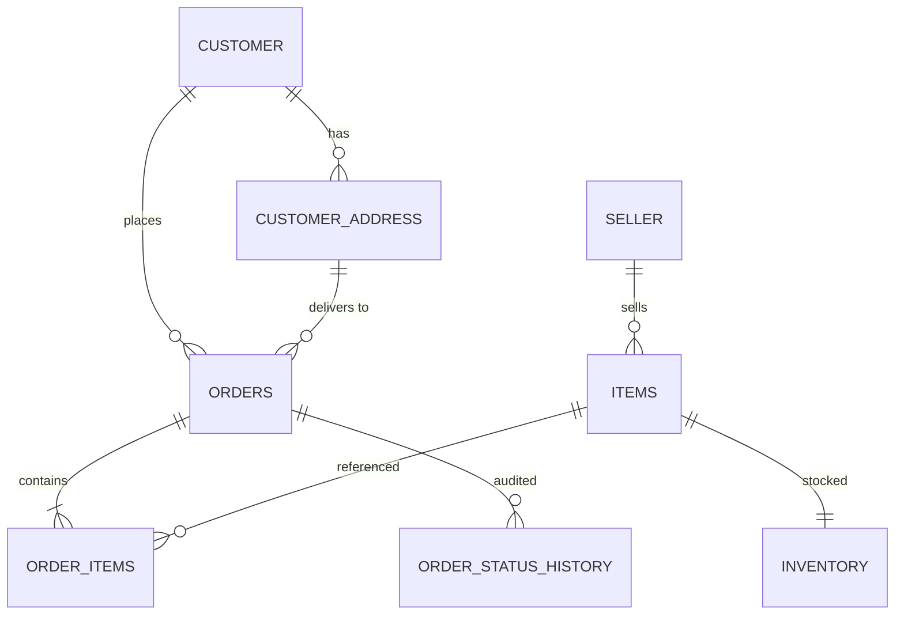
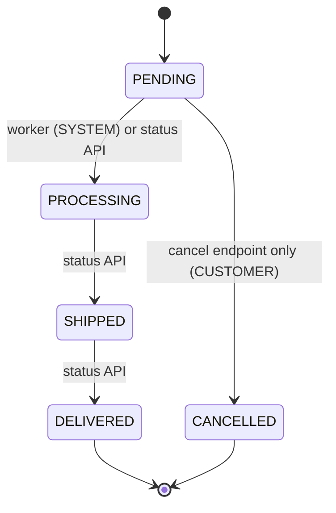

# E-commerce Order Processing System

Backend for a take-home assignment: customers place orders with multiple items, track and
update their status, and cancel them while still pending; a background job promotes
`PENDING` orders to `PROCESSING` every 5 minutes.

This README is written as a **progressive narrative** — it records not just what was built,
but how the requirements were analysed, which design discussions happened, what was scoped
in vs. deferred, and why each choice was made. The engineering checklist version lives in
[`docs/plan/execution-plan.md`](docs/plan/execution-plan.md).

> **Status**: design phase complete; implementation in progress. Sections marked
> _(to be filled)_ land with their corresponding build step.

---

## 1. Requirements analysis

The assignment asks for five core features:

1. **Create an order** — multiple items per order
2. **Retrieve order details** — by order id
3. **Update order status** — `PENDING` → `PROCESSING` → `SHIPPED` → `DELIVERED`, with a
   background job auto-promoting `PENDING` → `PROCESSING` every 5 minutes
4. **List all orders** — optionally filtered by status
5. **Cancel an order** — only while `PENDING`

Reading between the lines, the assignment is really testing three things: a clean order
**lifecycle state machine**, correctness under **concurrency** (the background job and a
customer's cancel can race), and the ability to scope a system sensibly. The design below
optimises for those.

## 2. Design discussion — full vision vs. implemented scope

### The full data model (future scope)

A production version of this system was sketched first: `customers`,
`customer_addresses` (multiple per customer, one primary, editable contact number),
`sellers` (GSTIN, contact details), `items` with seller ownership, `inventory`, `orders`,
and `order_items`.



### What is actually implemented — and why the cut

The assignment's core is the **order lifecycle**, not customer/seller CRUD. Implementing
the full model would multiply seed data, validation, and test surface without demonstrating
anything new. So the implemented schema is the subset that carries the lifecycle:

| Table | Purpose |
|---|---|
| `items` | Catalog: name, category, brand, description, **server-authoritative price** |
| `inventory` | `item_id` → `quantity`; decremented on order, restored on cancel |
| `orders` | `customer_id` (plain column for now), status, order value, payment mode/status, order date |
| `order_items` | Line items with a **price snapshot** at order time and a nullable `shipment_number` |
| `order_status_history` | Audit trail: `order_id`, `from_status`, `to_status`, `changed_at`, `changed_by` |

Customers, addresses, and sellers remain in the ERD above as documented future scope;
`orders.customer_id` becomes a real foreign key when the `customers` table lands.

## 3. Order lifecycle — strict single-step state machine



Statuses carry ordinals — `PENDING:0`, `PROCESSING:1`, `SHIPPED:2`, `DELIVERED:3`,
`CANCELLED:99` — and transitions must advance **exactly one step**. No skips
(`PENDING → SHIPPED` is rejected), no backwards moves. `CANCELLED` is reachable only from
`PENDING`, and only through the dedicated cancel endpoint; the generic status-update
endpoint refuses it.

Every transition writes an `order_status_history` row with `changed_by` set to `SYSTEM`
(worker), `CUSTOMER` (order create — recorded as `NEW → PENDING` — and cancel), or `ADMIN`
(status API default). The field is designed to be
extended with an actor id later — e.g. to distinguish *customer cancelled the order* from
*customer asked support to cancel it*.

## 4. Key decisions and their reasons

| Decision | Reason |
|---|---|
| **No ORM** — raw SQL via `mysql2/promise` | Keeps the system simple and the SQL visible. Every query goes through `pool.execute()` with parameterised placeholders (prepared statements) — no string interpolation, no injection surface. |
| **Connection pool as a singleton, 15 connections** | One pool per process; `connectionLimit: 15`, `waitForConnections: true`, `queueLimit: 0`, `enableKeepAlive: true` with `keepAliveInitialDelay: 10000` (prevents idle sockets being dropped in containerised networks), `maxIdle`/`idleTimeout` kept below MySQL's `wait_timeout` so the pool never hands out a stale connection, `namedPlaceholders: true` for readable parameterised SQL. |
| **Server-authoritative pricing** | `POST /order` looks up prices from `items` and computes `order_value` itself. A client-supplied expected total is *validated* (400 on mismatch), never trusted — otherwise a client could order anything for ₹1. `order_items.item_price` snapshots the price at order time so later catalog changes don't rewrite history. |
| **Atomic inventory decrement** | "Check stock, then insert" is a TOCTOU (time-of-check to time-of-use) race: two concurrent orders for the last unit both pass the check. Instead: `UPDATE inventory SET quantity = quantity - ? WHERE item_id = ? AND quantity >= ?` inside a transaction, checking `affectedRows` — the database serialises the race; the loser rolls back with **409**. |
| **Compare-and-swap status updates** | Cancel and the 5-minute worker can race on a `PENDING` order. All status changes are single UPDATEs with the expected current status in the `WHERE` clause (`... WHERE id = ? AND status = 'PENDING'`) — whichever lands first wins, the other affects 0 rows and returns 409. No read-then-write anywhere. |
| **Cancel restores inventory** | In the same transaction as the status flip — stock committed to a cancelled order goes back on the shelf atomically. |
| **409, not 403, for state conflicts** | 403 means "you are not authorised". "This order is no longer PENDING" is a resource-state conflict → **409 Conflict**, consistent with the insufficient-inventory response. |
| **`PATCH /order/:id/cancel`, not `DELETE`** | The record is never physically removed; only the status changes. |
| **List excludes CANCELLED by default** | The assignment enumerates only the four live statuses ("statuses **like** PENDING, PROCESSING, SHIPPED, DELIVERED"), so cancelled orders are treated as archived: the unfiltered list omits them, and `?order_status=CANCELLED` retrieves them explicitly. |
| **Interval worker now, BullMQ later** | See §6. |
| **Docker Compose (MySQL 8.4 + Node)** | One-command local setup for the reviewer. |

### Alternative considered: pessimistic / distributed locking (HTTP 423 + retry)

An alternative concurrency design was discussed for the TOCTOU races: take an explicit lock
per order (or inventory row) before updating — the lock holder proceeds, competing writers
receive **HTTP 423 Locked** with a `Retry-After` hint and retry client-side. Assessment,
recorded for transparency:

- **Within a single MySQL, pessimistic locking already exists natively** as
  `SELECT ... FOR UPDATE`: the row lock is held for the transaction and competing writers
  block on it — no extra infrastructure needed. A *distributed* lock (Redis `SET NX` /
  Redlock, ZooKeeper) earns its cost only when the critical section spans more than one
  datastore or service (e.g., inventory reservation + payment hold + shipment reservation as
  one exclusive unit), or to keep a scheduled job single-flight across app instances. It
  also brings failure modes that must then be designed for: lock TTL vs. transaction
  duration, holder crashes, and fencing tokens so a stale holder can't write after expiry.
- **CAS gives the losing client a better answer than 423.** For our races (cancel vs.
  worker), by the time a 423-receiving client retries, the state has almost always already
  changed — the retry just ends in a 409 anyway. CAS delivers that definitive answer
  immediately. 423 + retry is the right shape where the operation *might still succeed*
  once the lock frees (seat selection, long-lived edit sessions), not where contention
  itself decides the outcome.
- **Where a distributed lock genuinely fits this system**: making the 5-minute worker
  single-flight across multiple instances — which is exactly what the future BullMQ design
  provides (repeatable jobs are distributed-lock-backed, see §6).

**Verdict**: CAS for row-level transitions in this assignment; `SELECT ... FOR UPDATE`
where a read-modify-write inside one transaction is unavoidable (the worker's batch);
distributed locking reserved for future cross-service workflows and multi-instance worker
coordination.

## 5. API reference (draft)

| Method & path | Description | Success | Errors |
|---|---|---|---|
| `POST /order` | Place an order: `customer_id`, `payment_mode` (`COD`/`UPI`/`CC`/`DEBIT_CARD`/`WALLET`), `payment_status` (`COMPLETE`/`PENDING` — PENDING is the COD case), `items: [{item_id, quantity}]`, optional `expected_order_value`, optional `discount` (reserved) | `201` created order, status `PENDING` | `400` validation/price mismatch · `404` unknown item · `409` insufficient inventory |
| `GET /order` | List orders. Query: `order_status?`, `limit?` (default 20), `offset?` (default 0). No filter → all non-CANCELLED | `200` id, order date, item names + quantities, order value, status, payment status | `400` invalid query values |
| `GET /order/:id` | Order details: items `[{item_id, name, quantity, item_price, shipment_number}]`, order value, status, payment mode/status | `200` | `404` |
| `PATCH /order/:id/cancel` | Cancel; only from `PENDING`; restores inventory | `200` | `404` · `409` not PENDING |
| `PATCH /order/:id/status` | Body `{"status": "PROCESSING"\|"SHIPPED"\|"DELIVERED"}`; strict single-step | `200` | `400` disallowed value · `404` · `409` not the immediate successor |
| `GET /health` | Liveness + DB probe | `200` | `503` DB down |

Full contract with request/response shapes: [`docs/plan/execution-plan.md`](docs/plan/execution-plan.md) §3.

## 6. Background worker

**Implemented** (`src/workers/order-status-worker.js`): an in-process `setInterval` (5
minutes, env-configurable via `WORKER_INTERVAL_MS`) that promotes all `PENDING` orders to
`PROCESSING` in one transaction — `SELECT ... FOR UPDATE` snapshots the affected ids, a
single set-based `UPDATE` moves them all, one bulk `INSERT` writes their
`order_status_history` rows (`changed_by = 'SYSTEM'`) — and guards against overlapping ticks
with an in-process flag (a tick still running when the next timer fires is skipped, not
queued). No per-row discovery loop; a tick with zero PENDING orders is a cheap read-only pass that
skips the UPDATE/INSERT entirely.

**Production design (documented, not implemented)**: a **BullMQ + Redis** setup — a
repeatable job scheduled every 5 minutes enqueues status-update jobs; workers consume them
with retries, backoff, and dead-lettering. This matters once there are multiple app
instances: the naive interval would run once *per instance*, whereas BullMQ's repeatable
jobs give distributed locking for free. With CAS-style UPDATEs the duplicate runs are
harmless (idempotent), but the queue also buys observability, per-order retry semantics, and
horizontal scaling of the processing itself. Deferred to keep the assignment's footprint
honest.

## 7. Setup & run

Prerequisites: Docker (Desktop) with Compose v2.

```bash
cp .env.example .env      # adjust ports/passwords if needed
docker compose up --build -d
```

- App: `http://localhost:3005`. `APP_PORT` (host side) and `PORT` (container side) are
  configurable in `.env`.
- Smoke test: `curl localhost:3005/health` → `200 {"status":"ok","db":"up"}`
  (`503 {"status":"degraded","db":"down"}` if MySQL is unreachable).
- MySQL 8.4: `localhost:3306`, database `ecom`, app user `ecom_app` (credentials in `.env`).
  Seeded with 6 items, including one with a single unit in stock ("Last Unit Lamp", for the
  concurrency demo) and one out of stock ("Sold Out Speaker", for the 409 demo).

```bash
# Place an order (server computes order_value from the catalog)
curl -s -X POST localhost:3005/order \
  -H 'Content-Type: application/json' \
  -d '{"customer_id":"cust-1","payment_mode":"UPI","payment_status":"COMPLETE",
       "items":[{"item_id":1,"quantity":2}]}'
# → 201 with the created order (status PENDING)
# item_id 6 ("Sold Out Speaker") → 409 insufficient inventory
# unknown item_id → 404

# Inspect the seeded data
docker compose exec mysql mysql -uecom_app -p ecom \
  -e "SELECT i.id, i.name, inv.quantity FROM items i JOIN inventory inv ON inv.item_id=i.id;"
```

```bash
# List orders (default: excludes CANCELLED, page 1 of 20)
curl -s localhost:3005/order
# Explicitly retrieve cancelled orders
curl -s "localhost:3005/order?order_status=CANCELLED"
# Paginate: second order on the page
curl -s "localhost:3005/order?limit=1&offset=1"
# Invalid order_status → 400
curl -s "localhost:3005/order?order_status=bogus"

# Order detail (items include item_price and shipment_number, unlike the list view)
curl -s localhost:3005/order/1
# Unknown id → 404
curl -s localhost:3005/order/999999
```

```bash
# Cancel a PENDING order — inventory is restored, history gets a
# PENDING -> CANCELLED row by CUSTOMER
curl -s -X PATCH localhost:3005/order/1/cancel
# Cancelling the same order again → 409 (no longer PENDING)
curl -s -X PATCH localhost:3005/order/1/cancel
# Unknown id → 404
curl -s -X PATCH localhost:3005/order/999999/cancel
```

```bash
# Advance a PENDING order one step at a time — each history row is written
# with changed_by='ADMIN'
curl -s -X PATCH localhost:3005/order/2/status -H 'Content-Type: application/json' -d '{"status":"PROCESSING"}'
curl -s -X PATCH localhost:3005/order/2/status -H 'Content-Type: application/json' -d '{"status":"SHIPPED"}'
curl -s -X PATCH localhost:3005/order/2/status -H 'Content-Type: application/json' -d '{"status":"DELIVERED"}'
# Skip a step (PENDING -> SHIPPED) → 409, not the immediate successor
curl -s -X PATCH localhost:3005/order/3/status -H 'Content-Type: application/json' -d '{"status":"SHIPPED"}'
# Move backwards (DELIVERED -> PROCESSING) → 409
curl -s -X PATCH localhost:3005/order/2/status -H 'Content-Type: application/json' -d '{"status":"PROCESSING"}'
# CANCELLED/PENDING as a target → 400 (only PROCESSING/SHIPPED/DELIVERED are accepted)
curl -s -X PATCH localhost:3005/order/2/status -H 'Content-Type: application/json' -d '{"status":"CANCELLED"}'
# Unknown id → 404
curl -s -X PATCH localhost:3005/order/999999/status -H 'Content-Type: application/json' -d '{"status":"PROCESSING"}'
```

```bash
# Watch the worker promote a PENDING order to PROCESSING. To see it without
# waiting the default 5 minutes, set WORKER_INTERVAL_MS=5000 in .env and
# `docker compose up --build -d` before placing the order below.
curl -s -X POST localhost:3005/order \
  -H 'Content-Type: application/json' \
  -d '{"customer_id":"cust-1","payment_mode":"UPI","payment_status":"COMPLETE",
       "items":[{"item_id":1,"quantity":1}]}'
# → id in the response body; wait one tick, then:
curl -s localhost:3005/order/<id>
# → status: "PROCESSING"

# Confirm the SYSTEM-authored history row
docker compose exec mysql mysql -uecom_app -p ecom \
  -e "SELECT order_id, from_status, to_status, changed_by, changed_at FROM order_status_history WHERE changed_by='SYSTEM';"
```

**Re-seeding**: `db/init.sql` runs only when the MySQL data volume is empty. To reset:

```bash
docker compose down -v && docker compose up -d
```

## 8. Testing

Jest + Supertest integration tests run against the same dockerized MySQL (`ecom`) the app
uses — `src/app.js` is imported directly (no `.listen()`, no HTTP hop), so only the
`mysql` service needs to be up, not the `app` container.

```bash
docker compose up -d mysql   # only the DB needs to be running
cp .env.example .env         # if not already present
npm install
npm test
```

**Coverage** (`tests/*.test.js`):
- `order-create.test.js` — create happy path (single + multi-item); validation 400s
  (missing field, empty `items[]`, over-cap quantity, `expected_order_value` mismatch);
  unknown item 404; sold-out item 409; **concurrent create race on the last unit** — 5
  parallel orders for the single-unit "Last Unit Lamp", exactly one `201` and four `409`s.
- `order-read.test.js` — list default excludes `CANCELLED`, `?order_status=` filter,
  `limit`/`offset` pagination, invalid query 400; order detail 200/404/400.
- `order-cancel.test.js` — cancel restores inventory and writes the history row;
  double-cancel 409; unknown id 404.
- `order-status.test.js` — stepwise `PENDING→PROCESSING→SHIPPED→DELIVERED`; skip and
  backwards transitions rejected 409; disallowed body values (`CANCELLED`/`PENDING`) 400;
  unknown id 404.
- `worker.test.js` — `promotePendingOrders()` (the Step 7 tick, called directly — no real
  timers) promotes every `PENDING` order with `SYSTEM` history rows; zero-`PENDING` tick
  is a no-op; `runWorkerTick()`'s overlap guard skips a second tick fired before the first
  resolves. `start()`/`stop()`'s interval-driven behavior isn't re-tested here — it was
  already manually verified in Step 7 (§10 below); automating it would need fake timers
  layered over real async DB calls for little added confidence over calling
  `promotePendingOrders()`/`runWorkerTick()` directly.

**Test DB is the same `ecom` database, deliberately** — `tests/helpers/db.js` resets all
order-related tables (and restores seeded inventory quantities) before every test, so
running `npm test` wipes any orders created via the §7 curl walkthrough in that MySQL
instance. **In a real production setup this would be a separate staging/test database**,
never the same instance as dev/demo data; here they share one because this is a take-home
assignment and the `ecom_app` user's grants are scoped to the single `ecom` database (see
§10's Step 8 entry for the full reasoning).

## 9. Future scope

- `customers`, `customer_addresses`, `sellers` tables per the ERD in §2; `orders.customer_id`
  and `items.seller_id` become real foreign keys
- Authentication and a real actor model (`changed_by` → actor id)
- Payments integration (currently only mode/status fields are captured)
- Shipping and invoice generation (assumed to be separate services)
- BullMQ + Redis worker (§6)
- `discount` field on order creation (accepted, reserved, unused)
- UI

## 10. AI usage log (assignment-mandated)

The assignment encourages extensive AI use and asks for an account of what it was used for,
what issues were found, and how they were corrected. This log is appended to at every step.

### Design phase (2026-07-11) — Claude Code

- **Used for**: reviewing the initial hand-written design (data model, API surface,
  worker approach) before implementation.
- **Issues the AI review surfaced, and the resolutions**:
  1. *Client-trusted pricing* — the initial `POST /order` accepted order value and per-item
     prices from the caller. Changed to server-authoritative pricing with client totals
     validated, not trusted.
  2. *Inventory TOCTOU (time-of-check to time-of-use) race* — "check availability then insert" allows two concurrent
     orders to both claim the last unit. Changed to an atomic conditional decrement with
     `affectedRows` checking inside a transaction.
  3. *Cancel didn't restore inventory* — added restore in the same transaction as the
     status flip.
  4. *Cancel vs. worker race* — both now use compare-and-swap UPDATEs keyed on the expected
     current status, so the race resolves cleanly whichever side wins.
  5. *Wrong status code* — cancel-not-allowed originally returned `403`; corrected to `409`
     (state conflict, not authorisation).
  6. *Unbounded status updates* — the update endpoint originally accepted any of
     PROCESSING/SHIPPED/DELIVERED, permitting backwards moves. A state machine was added;
     after discussion it was tightened from "any higher ordinal" to **strict single-step**.
  7. *Missing pieces flagged*: `created_at`/`updated_at` timestamps, indexes on
     `orders.status`/`orders.customer_id`/`order_items.order_id`, pagination on the list
     endpoint, the `order_status_history` audit table, and this AI-usage log itself.
- **AI suggestions that were overridden or refined by the author**:
  - The AI's default list semantics (no filter → *everything* including CANCELLED) was
    rejected in favour of excluding CANCELLED by default, based on the assignment wording.
  - Scope: the AI recommended cutting customers/sellers/addresses from the implementation;
    accepted, with the full model retained here as documented future scope.
  - `PUT /order/:id` was renamed to `PATCH /order/:id/status` per AI suggestion.
  - *Pessimistic / distributed locking with HTTP 423 + retry* was proposed by the author as
    a production-grade alternative to CAS for the TOCTOU races. The AI's counter-analysis:
    within a single MySQL, `SELECT ... FOR UPDATE` already provides pessimistic semantics
    without extra infrastructure; a distributed lock pays off only for cross-service
    critical sections or multi-instance job single-flight (which the future BullMQ design
    covers), and 423 + retry mostly defers a conflict that CAS can report definitively as
    409 right away. Outcome: CAS retained for row-level transitions, the locking
    alternative documented with its trade-offs in §4.

### Step 1 — Schema + infra (2026-07-11) — Claude Code

- **Used for**: generating `db/init.sql` (DDL + seed data), `docker-compose.yml`,
  `Dockerfile`, `.env.example`, and the placeholder server; then verifying the stack
  end-to-end (containers healthy, tables + seeds present, app reachable).
- **Issues found during verification, and the corrections**:
  1. *Compose/app port mismatch risk* — the compose mapping initially hardcoded the
     container-side port instead of following the app's configured listen port; corrected
     to `"${APP_PORT}:${PORT}"` so both sides are driven by `.env`.
- **Verification performed** (all passed): 5 tables + 6 seeded items present; CHECK
  constraint rejects negative inventory (`ERROR 3819`); FK rejects order_items pointing at
  a nonexistent order (`ERROR 1452`) — both errors deliberately provoked as negative tests;
  placeholder app answers on the mapped port; `docker compose down -v && up` re-seeds
  cleanly.

### Step 2 — App skeleton (2026-07-11) — Claude Code

- **Used for**: generating the Express bootstrap — `src/config.js` (single env reader),
  `src/db/pool.js` (pool singleton per the locked spec plus a `withTransaction` helper for
  later steps), `src/errors.js` (typed `AppError` + factories), the centralized error
  middleware, the zod `validate` middleware factory, `GET /health` with a `SELECT 1` DB
  probe, `src/app.js` (exported without `listen` so Supertest can import it), and
  `src/server.js` with graceful SIGTERM/SIGINT shutdown (close server, drain pool).
- **Issues found during verification**: none requiring correction this step — the skeleton
  passed all checks on the first build.
- **Verification performed** (all passed): `/health` → 200 with DB up; unknown route → 404
  JSON; malformed JSON body → 400 (not a stack trace); stopping MySQL degrades `/health`
  to 503 without crashing the app, and restarting MySQL recovers it to 200 within seconds
  **without an app restart** (pool + keep-alive settings doing their job); `docker compose
  stop app` completes in ~1s with `SIGTERM received, shutting down` logged (graceful
  shutdown, no 10s kill timeout).

### Step 3 — POST /order (2026-07-11) — Claude Code

- **Used for**: generating `src/routes/orders.js`, `src/schemas/order-schemas.js`, and
  `src/services/order-service.js` — the §5.1 transactional create flow (server-side price
  lookup, atomic conditional inventory decrement, orders/order_items/history inserts); then
  a separate AI review pass of the finished code against the execution plan and this README.
- **Beyond the plan, added by the AI and kept**: duplicate `item_id` lines are merged before
  decrementing (so shortfall checks stay correct for repeated ids); inventory decrements run
  in ascending `item_id` order to avoid InnoDB lock-ordering deadlocks between concurrent
  orders; money is summed in integer cents to avoid float drift.
- **Issues the review found, and the corrections**:
  1. *Doc drift on `changed_by`* — the service records the create-history row
     (`NEW → PENDING`) with `changed_by='CUSTOMER'`, but the docs defined `CUSTOMER` as
     "cancel endpoint" only. Docs corrected (§3 here, exec-plan §2, `db/init.sql` comment);
     the code's choice was kept as the right semantics.
  2. *Unbounded quantities* — an absurd `quantity` would overflow `DECIMAL(12,2)` and
     surface as a 500 instead of a validation error. Added caps to the zod schema
     (`quantity ≤ 10000`, ≤ 100 order lines) so it's a clean 400.
  3. *Docs step scope initially skipped* — this log entry, the §7 curl example, and the
     exec-plan tick were missing after the code landed; added as part of the review.
- **Verification performed** (all passed): happy path → 201 with server-computed
  `order_value` and PENDING status, inventory decremented, history row `NEW → PENDING` by
  CUSTOMER; sold-out item → 409 with the failing `item_id`, transaction rolled back (no
  partial order/inventory rows); unknown item → 404 with `unknown_item_ids`;
  `expected_order_value` mismatch → 400 with expected vs. computed; over-cap quantity → 400
  validation error.

### Step 4 — Read endpoints (2026-07-12) — Claude Code

- **Used for**: generating `GET /order` and `GET /order/:id` in `src/routes/orders.js`,
  the corresponding `listOrders`/`getOrderById` in `src/services/order-service.js`, and
  `orderIdParamSchema`/`listOrdersQuerySchema` in `src/schemas/order-schemas.js`; then
  manual verification against the dockerized stack.
- **Issues found during verification, and the corrections**:
  1. *`ER_WRONG_ARGUMENTS` on `GET /order`* — `LIMIT`/`OFFSET` bound as named
     placeholders through `pool.execute()` (a server-side prepared statement) fail against
     MySQL 8.4 (`Incorrect arguments to mysqld_stmt_execute`) — a known `mysql2`/MySQL
     limitation on placeholders in `LIMIT`/`OFFSET`. Fixed by using `pool.query()` for that
     one query instead; params are still bound (not string-interpolated) and `limit`/
     `offset` are pre-validated as integers by `listOrdersQuerySchema`, so this keeps the
     no-string-interpolation rule intact while avoiding the prepared-statement path.
- **Verification performed** (all passed): `GET /order` with no query excludes CANCELLED and
  defaults to `limit=20, offset=0`; `?order_status=CANCELLED` returns only cancelled orders
  (`[]` against current seed/test data — none cancelled yet, pending Step 5); `limit`/
  `offset` produce non-overlapping pages; `?order_status=bogus` → 400; `GET /order/:id` for
  an existing order → 200 with full item detail (`item_price`, `shipment_number: null`);
  `GET /order/999999` → 404; `GET /order/abc` → 400 (non-numeric id rejected by
  `orderIdParamSchema`'s coercion).

### Step 5 — `PATCH /order/:id/cancel` (2026-07-12) — Claude Code

- **Used for**: generating `cancelOrder` in `src/services/order-service.js` and the
  `PATCH /order/:id/cancel` route in `src/routes/orders.js` — the §5.2 transactional cancel
  flow (CAS status flip, inventory restore, history row), reusing the existing
  `orderIdParamSchema`; then manual verification against the dockerized stack.
- **Beyond the plan, added by the AI and kept**: `getOrderById` and `cancelOrder` both need
  the same order+items JOIN and row-shaping for their response; extracted into a shared
  `ORDER_WITH_ITEMS_SQL` constant and `mapOrderRows` helper instead of duplicating the query
  and mapping logic.
- **Issues found during verification**: none requiring correction this step — the endpoint
  passed all checks on the first build.
- **Verification performed** (all passed): cancelling a PENDING order → `200`,
  `status: CANCELLED`, inventory restored (verified before/after quantities), history row
  `PENDING → CANCELLED` by `CUSTOMER`; cancelling the same order again → `409` with the
  current status in `details`; unknown id → `404`; non-numeric id → `400`; the cancelled
  order is excluded from the default `GET /order` list and appears under
  `?order_status=CANCELLED`, matching Step 4's filter semantics.

### Step 6 — `PATCH /order/:id/status` (2026-07-12) — Claude Code

- **Used for**: generating `updateOrderStatus` in `src/services/order-service.js` and the
  `PATCH /order/:id/status` route in `src/routes/orders.js` — the §5.3 CAS transition flow
  keyed on a per-target predecessor map (`PROCESSING←PENDING`, `SHIPPED←PROCESSING`,
  `DELIVERED←SHIPPED`), plus `updateOrderStatusSchema` in `src/schemas/order-schemas.js`
  restricting the request body to `PROCESSING`/`SHIPPED`/`DELIVERED` so `CANCELLED` and
  `PENDING` targets are rejected as `400`s at the validation layer rather than `409`s in the
  service; then manual verification against the dockerized stack.
- **Beyond the plan, added by the AI and kept**: reused the existing `ORDER_WITH_ITEMS_SQL` /
  `mapOrderRows` helpers (already shared by `getOrderById` and `cancelOrder`) for the
  response, so all three endpoints return the same order shape without duplicating the
  read-back query.
- **Issues found during verification**: none requiring correction this step — the endpoint
  passed all checks on the first build.
- **Verification performed** (all passed): a fresh order advances stepwise
  `PENDING → PROCESSING → SHIPPED → DELIVERED`, each `200` with a matching
  `order_status_history` row (`changed_by='ADMIN'`); skipping a step (`PENDING → SHIPPED`)
  and moving backwards (`DELIVERED → PROCESSING`) both → `409` with the order's actual
  current status in `details`; `CANCELLED` or `PENDING` as the request body → `400`
  (schema-level rejection, distinct error shape from the `409`s); unknown id → `404`;
  cancelling a `PENDING` order and then immediately attempting a status update on it → `409`
  (CAS resolves the cancel-vs-status race the same way it resolves cancel-vs-worker).

### Step 7 — Background worker (2026-07-12) — Claude Code

- **Used for**: generating `src/workers/order-status-worker.js` — the §5.4 promotion flow
  (`SELECT ... FOR UPDATE` to snapshot affected ids, a single set-based `UPDATE`, one bulk
  `INSERT` for the `order_status_history` rows, all in one transaction), the in-process
  overlap guard, and the `start()`/`stop()` wiring into `src/server.js`'s listen/shutdown
  lifecycle; then manual verification against the dockerized stack with a shortened interval.
- **Beyond the plan, added by the AI and kept**: `promotePendingOrders()` (the pure
  transactional tick) is exported separately from `runWorkerTick()` (the overlap-guarded
  wrapper the interval calls), so a single tick can be invoked directly without waiting on a
  real timer — needed for Step 8's tests. `stop()` is `async` and awaits any in-flight tick
  before returning, so graceful shutdown never races a live transaction against `pool.end()`.
- **Issues found during verification**: none requiring correction this step — the worker
  passed all checks on the first build.
- **Verification performed** (all passed): with `WORKER_INTERVAL_MS=5000`, a freshly created
  PENDING order flips to `PROCESSING` within one tick (`GET /order/:id`); a matching
  `order_status_history` row (`PENDING → PROCESSING`, `changed_by='SYSTEM'`) is written; a
  tick with zero PENDING orders skips the UPDATE/INSERT (logging `promoted 0 order(s)`)
  within a short read-only transaction; forcing two overlapping ticks confirms the second is skipped
  (`"previous tick still running"` logged, no duplicate history row); `docker compose stop
  app` mid-interval still shuts down promptly with no "pool closed" errors, matching Step 2's
  graceful-shutdown behavior.

### Step 8 — Tests (2026-07-12) — Claude Code

- **Used for**: generating `tests/helpers/db.js` (DB reset + assertion helpers) and the
  five Jest + Supertest suites (`tests/order-create.test.js`, `order-read.test.js`,
  `order-cancel.test.js`, `order-status.test.js`, `worker.test.js`) plus `jest.config.js`;
  then running the suite against the dockerized MySQL.
- **Beyond the plan, added by the AI and kept**: `getInventoryQuantity`/`getStatusHistory`
  helpers in `tests/helpers/db.js` so tests can assert on state the HTTP API doesn't
  expose directly (inventory quantities, `order_status_history` rows/`changed_by`)
  without duplicating raw SQL in every test file.
- **AI suggestion refined by the author**: the AI's default approach reuses the single
  `ecom` database for tests (`resetDatabase()` truncates order-related tables and
  restores seeded inventory before every test — see README §8). Per the author: **in a
  real production setup, tests would run against a separate staging/test database**,
  never the same instance dev or demo data lives in; here the two share one purely
  because this is a take-home assignment and the `ecom_app` user's grants (created by the
  official `mysql` image, scoped to `MYSQL_DATABASE=ecom`) don't extend to creating a
  second database — spinning up a dedicated test DB would mean a second compose
  service/init script for marginal benefit at this scope.
- **Issues found during verification**: none requiring correction — all suites passed on
  the first run against the dockerized MySQL, and 5 consecutive re-runs confirmed the
  concurrent-create-race test is not flaky (exactly one `201` every time).
- **Verification performed** (all passed): `npm test` — 5 suites, 28 tests green,
  `<2s` runtime, no Jest open-handle warnings (confirms each suite's `afterAll(() =>
  pool.end())` closes its own pool cleanly). Covers: create happy path (single/multi-item);
  validation 400s; unknown-item 404; sold-out-item 409; **5 concurrent orders racing the
  last unit of item 5 — exactly one `201`, four `409`s, final inventory `0`**; list
  filter/pagination/400; order detail 200/404/400; cancel + inventory restore + history
  row; double-cancel 409; unknown id 404; stepwise `PENDING→PROCESSING→SHIPPED→DELIVERED`;
  skip/backwards transitions 409; disallowed body values 400; worker's `promotePendingOrders()`
  batch-promotes with `SYSTEM` history rows, zero-`PENDING` tick is a no-op, and
  `runWorkerTick()`'s overlap guard skips a second tick fired before the first resolves.

_(Entries for implementation step 9 will be appended as it lands.)_
