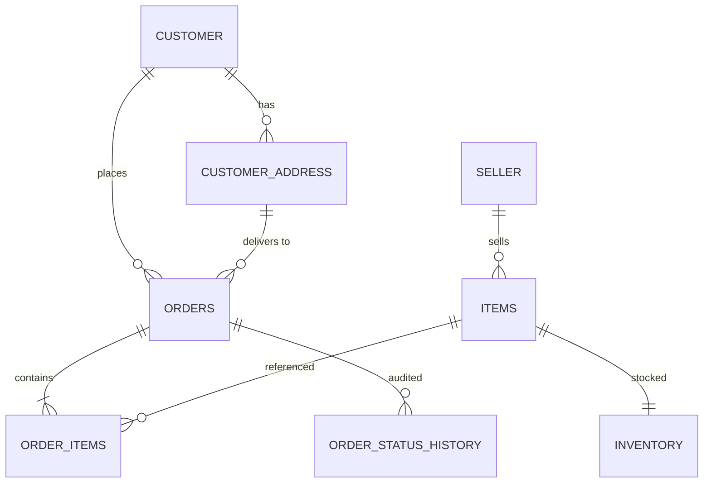
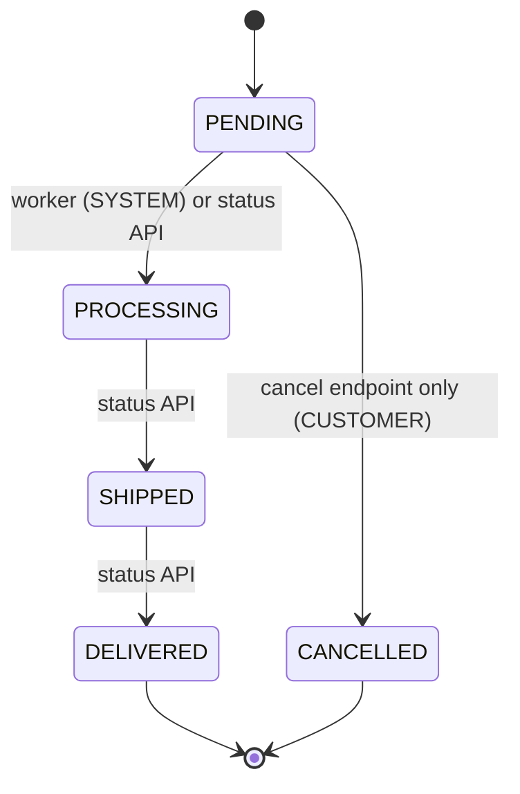

# E-commerce Order Processing System

Backend for a take-home assignment: customers place orders with multiple items, track and
update their status, and cancel them while still pending; a background job promotes
`PENDING` orders to `PROCESSING` every 5 minutes.

This README is written as a **progressive narrative** — it records not just what was built,
but how the requirements were analysed, which design discussions happened, what was scoped
in vs. deferred, and why each choice was made. The engineering checklist version lives in
[`docs/plan/execution-plan.md`](docs/plan/execution-plan.md).

> **Status**: design phase complete; implementation in progress. Sections marked
> _(to be filled)_ land with their corresponding build step.

---

## 1. Requirements analysis

The assignment asks for five core features:

1. **Create an order** — multiple items per order
2. **Retrieve order details** — by order id
3. **Update order status** — `PENDING` → `PROCESSING` → `SHIPPED` → `DELIVERED`, with a
   background job auto-promoting `PENDING` → `PROCESSING` every 5 minutes
4. **List all orders** — optionally filtered by status
5. **Cancel an order** — only while `PENDING`

Reading between the lines, the assignment is really testing three things: a clean order
**lifecycle state machine**, correctness under **concurrency** (the background job and a
customer's cancel can race), and the ability to scope a system sensibly. The design below
optimises for those.

## 2. Design discussion — full vision vs. implemented scope

### The full data model (future scope)

A production version of this system was sketched first: `customers`,
`customer_addresses` (multiple per customer, one primary, editable contact number),
`sellers` (GSTIN, contact details), `items` with seller ownership, `inventory`, `orders`,
and `order_items`.



### What is actually implemented — and why the cut

The assignment's core is the **order lifecycle**, not customer/seller CRUD. Implementing
the full model would multiply seed data, validation, and test surface without demonstrating
anything new. So the implemented schema is the subset that carries the lifecycle:

| Table | Purpose |
|---|---|
| `items` | Catalog: name, category, brand, description, **server-authoritative price** |
| `inventory` | `item_id` → `quantity`; decremented on order, restored on cancel |
| `orders` | `customer_id` (plain column for now), status, order value, payment mode/status, order date |
| `order_items` | Line items with a **price snapshot** at order time and a nullable `shipment_number` |
| `order_status_history` | Audit trail: `order_id`, `from_status`, `to_status`, `changed_at`, `changed_by` |

Customers, addresses, and sellers remain in the ERD above as documented future scope;
`orders.customer_id` becomes a real foreign key when the `customers` table lands.

## 3. Order lifecycle — strict single-step state machine



Statuses carry ordinals — `PENDING:0`, `PROCESSING:1`, `SHIPPED:2`, `DELIVERED:3`,
`CANCELLED:99` — and transitions must advance **exactly one step**. No skips
(`PENDING → SHIPPED` is rejected), no backwards moves. `CANCELLED` is reachable only from
`PENDING`, and only through the dedicated cancel endpoint; the generic status-update
endpoint refuses it.

Every transition writes an `order_status_history` row with `changed_by` set to `SYSTEM`
(worker), `CUSTOMER` (cancel), or `ADMIN` (status API default). The field is designed to be
extended with an actor id later — e.g. to distinguish *customer cancelled the order* from
*customer asked support to cancel it*.

## 4. Key decisions and their reasons

| Decision | Reason |
|---|---|
| **No ORM** — raw SQL via `mysql2/promise` | Keeps the system simple and the SQL visible. Every query goes through `pool.execute()` with parameterised placeholders (prepared statements) — no string interpolation, no injection surface. |
| **Connection pool as a singleton, 15 connections** | One pool per process; `connectionLimit: 15`, `waitForConnections: true`, `queueLimit: 0`, `enableKeepAlive: true` with `keepAliveInitialDelay: 10000` (prevents idle sockets being dropped in containerised networks), `maxIdle`/`idleTimeout` kept below MySQL's `wait_timeout` so the pool never hands out a stale connection, `namedPlaceholders: true` for readable parameterised SQL. |
| **Server-authoritative pricing** | `POST /order` looks up prices from `items` and computes `order_value` itself. A client-supplied expected total is *validated* (400 on mismatch), never trusted — otherwise a client could order anything for ₹1. `order_items.item_price` snapshots the price at order time so later catalog changes don't rewrite history. |
| **Atomic inventory decrement** | "Check stock, then insert" is a TOCTOU (time-of-check to time-of-use) race: two concurrent orders for the last unit both pass the check. Instead: `UPDATE inventory SET quantity = quantity - ? WHERE item_id = ? AND quantity >= ?` inside a transaction, checking `affectedRows` — the database serialises the race; the loser rolls back with **409**. |
| **Compare-and-swap status updates** | Cancel and the 5-minute worker can race on a `PENDING` order. All status changes are single UPDATEs with the expected current status in the `WHERE` clause (`... WHERE id = ? AND status = 'PENDING'`) — whichever lands first wins, the other affects 0 rows and returns 409. No read-then-write anywhere. |
| **Cancel restores inventory** | In the same transaction as the status flip — stock committed to a cancelled order goes back on the shelf atomically. |
| **409, not 403, for state conflicts** | 403 means "you are not authorised". "This order is no longer PENDING" is a resource-state conflict → **409 Conflict**, consistent with the insufficient-inventory response. |
| **`PATCH /order/:id/cancel`, not `DELETE`** | The record is never physically removed; only the status changes. |
| **List excludes CANCELLED by default** | The assignment enumerates only the four live statuses ("statuses **like** PENDING, PROCESSING, SHIPPED, DELIVERED"), so cancelled orders are treated as archived: the unfiltered list omits them, and `?order_status=CANCELLED` retrieves them explicitly. |
| **Interval worker now, BullMQ later** | See §6. |
| **Docker Compose (MySQL 8.4 + Node)** | One-command local setup for the reviewer. |

### Alternative considered: pessimistic / distributed locking (HTTP 423 + retry)

An alternative concurrency design was discussed for the TOCTOU races: take an explicit lock
per order (or inventory row) before updating — the lock holder proceeds, competing writers
receive **HTTP 423 Locked** with a `Retry-After` hint and retry client-side. Assessment,
recorded for transparency:

- **Within a single MySQL, pessimistic locking already exists natively** as
  `SELECT ... FOR UPDATE`: the row lock is held for the transaction and competing writers
  block on it — no extra infrastructure needed. A *distributed* lock (Redis `SET NX` /
  Redlock, ZooKeeper) earns its cost only when the critical section spans more than one
  datastore or service (e.g., inventory reservation + payment hold + shipment reservation as
  one exclusive unit), or to keep a scheduled job single-flight across app instances. It
  also brings failure modes that must then be designed for: lock TTL vs. transaction
  duration, holder crashes, and fencing tokens so a stale holder can't write after expiry.
- **CAS gives the losing client a better answer than 423.** For our races (cancel vs.
  worker), by the time a 423-receiving client retries, the state has almost always already
  changed — the retry just ends in a 409 anyway. CAS delivers that definitive answer
  immediately. 423 + retry is the right shape where the operation *might still succeed*
  once the lock frees (seat selection, long-lived edit sessions), not where contention
  itself decides the outcome.
- **Where a distributed lock genuinely fits this system**: making the 5-minute worker
  single-flight across multiple instances — which is exactly what the future BullMQ design
  provides (repeatable jobs are distributed-lock-backed, see §6).

**Verdict**: CAS for row-level transitions in this assignment; `SELECT ... FOR UPDATE`
where a read-modify-write inside one transaction is unavoidable (the worker's batch);
distributed locking reserved for future cross-service workflows and multi-instance worker
coordination.

## 5. API reference (draft)

| Method & path | Description | Success | Errors |
|---|---|---|---|
| `POST /order` | Place an order: `customer_id`, `payment_mode` (`COD`/`UPI`/`CC`/`DEBIT_CARD`/`WALLET`), `payment_status` (`COMPLETE`/`PENDING` — PENDING is the COD case), `items: [{item_id, quantity}]`, optional `expected_order_value`, optional `discount` (reserved) | `201` created order, status `PENDING` | `400` validation/price mismatch · `404` unknown item · `409` insufficient inventory |
| `GET /order` | List orders. Query: `order_status?`, `limit?` (default 20), `offset?` (default 0). No filter → all non-CANCELLED | `200` id, order date, item names + quantities, order value, status, payment status | `400` invalid query values |
| `GET /order/:id` | Order details: items `[{item_id, name, quantity, item_price, shipment_number}]`, order value, status, payment mode/status | `200` | `404` |
| `PATCH /order/:id/cancel` | Cancel; only from `PENDING`; restores inventory | `200` | `404` · `409` not PENDING |
| `PATCH /order/:id/status` | Body `{"status": "PROCESSING"\|"SHIPPED"\|"DELIVERED"}`; strict single-step | `200` | `400` disallowed value · `404` · `409` not the immediate successor |
| `GET /health` | Liveness + DB probe | `200` | `503` DB down |

Full contract with request/response shapes: [`docs/plan/execution-plan.md`](docs/plan/execution-plan.md) §3.

## 6. Background worker

**Implemented**: an in-process `setInterval` (5 minutes, env-configurable) that promotes all
`PENDING` orders to `PROCESSING` in a single set-based UPDATE inside a transaction, writes
`order_status_history` rows (`changed_by = 'SYSTEM'`), and guards against overlapping ticks.
One SQL statement moves the whole batch — no per-row discovery loop.

**Production design (documented, not implemented)**: a **BullMQ + Redis** setup — a
repeatable job scheduled every 5 minutes enqueues status-update jobs; workers consume them
with retries, backoff, and dead-lettering. This matters once there are multiple app
instances: the naive interval would run once *per instance*, whereas BullMQ's repeatable
jobs give distributed locking for free. With CAS-style UPDATEs the duplicate runs are
harmless (idempotent), but the queue also buys observability, per-order retry semantics, and
horizontal scaling of the processing itself. Deferred to keep the assignment's footprint
honest.

## 7. Setup & run

Prerequisites: Docker (Desktop) with Compose v2.

```bash
cp .env.example .env      # adjust ports/passwords if needed
docker compose up --build -d
```

- App: `http://localhost:3005` (placeholder 503 until the Express skeleton lands in Step 2).
  `APP_PORT` (host side) and `PORT` (container side) are configurable in `.env`.
- MySQL 8.4: `localhost:3306`, database `ecom`, app user `ecom_app` (credentials in `.env`).
  Seeded with 6 items, including one with a single unit in stock ("Last Unit Lamp", for the
  concurrency demo) and one out of stock ("Sold Out Speaker", for the 409 demo).

```bash
# Inspect the seeded data
docker compose exec mysql mysql -uecom_app -p ecom \
  -e "SELECT i.id, i.name, inv.quantity FROM items i JOIN inventory inv ON inv.item_id=i.id;"
```

**Re-seeding**: `db/init.sql` runs only when the MySQL data volume is empty. To reset:

```bash
docker compose down -v && docker compose up -d
```

## 8. Testing _(to be filled — lands with Step 8)_

Planned: Jest + Supertest integration tests against the dockerized MySQL, covering the
create happy path, insufficient inventory, a **concurrent create race on the last unit**
(exactly one order must win), cancel + inventory restore, cancel rejection, stepwise
transitions, skip/backwards rejection, and the worker's batch promotion.

## 9. Future scope

- `customers`, `customer_addresses`, `sellers` tables per the ERD in §2; `orders.customer_id`
  and `items.seller_id` become real foreign keys
- Authentication and a real actor model (`changed_by` → actor id)
- Payments integration (currently only mode/status fields are captured)
- Shipping and invoice generation (assumed to be separate services)
- BullMQ + Redis worker (§6)
- `discount` field on order creation (accepted, reserved, unused)
- UI

## 10. AI usage log (assignment-mandated)

The assignment encourages extensive AI use and asks for an account of what it was used for,
what issues were found, and how they were corrected. This log is appended to at every step.

### Design phase (2026-07-11) — Claude Code

- **Used for**: reviewing the initial hand-written design (data model, API surface,
  worker approach) before implementation.
- **Issues the AI review surfaced, and the resolutions**:
  1. *Client-trusted pricing* — the initial `POST /order` accepted order value and per-item
     prices from the caller. Changed to server-authoritative pricing with client totals
     validated, not trusted.
  2. *Inventory TOCTOU (time-of-check to time-of-use) race* — "check availability then insert" allows two concurrent
     orders to both claim the last unit. Changed to an atomic conditional decrement with
     `affectedRows` checking inside a transaction.
  3. *Cancel didn't restore inventory* — added restore in the same transaction as the
     status flip.
  4. *Cancel vs. worker race* — both now use compare-and-swap UPDATEs keyed on the expected
     current status, so the race resolves cleanly whichever side wins.
  5. *Wrong status code* — cancel-not-allowed originally returned `403`; corrected to `409`
     (state conflict, not authorisation).
  6. *Unbounded status updates* — the update endpoint originally accepted any of
     PROCESSING/SHIPPED/DELIVERED, permitting backwards moves. A state machine was added;
     after discussion it was tightened from "any higher ordinal" to **strict single-step**.
  7. *Missing pieces flagged*: `created_at`/`updated_at` timestamps, indexes on
     `orders.status`/`orders.customer_id`/`order_items.order_id`, pagination on the list
     endpoint, the `order_status_history` audit table, and this AI-usage log itself.
- **AI suggestions that were overridden or refined by the author**:
  - The AI's default list semantics (no filter → *everything* including CANCELLED) was
    rejected in favour of excluding CANCELLED by default, based on the assignment wording.
  - Scope: the AI recommended cutting customers/sellers/addresses from the implementation;
    accepted, with the full model retained here as documented future scope.
  - `PUT /order/:id` was renamed to `PATCH /order/:id/status` per AI suggestion.
  - *Pessimistic / distributed locking with HTTP 423 + retry* was proposed by the author as
    a production-grade alternative to CAS for the TOCTOU races. The AI's counter-analysis:
    within a single MySQL, `SELECT ... FOR UPDATE` already provides pessimistic semantics
    without extra infrastructure; a distributed lock pays off only for cross-service
    critical sections or multi-instance job single-flight (which the future BullMQ design
    covers), and 423 + retry mostly defers a conflict that CAS can report definitively as
    409 right away. Outcome: CAS retained for row-level transitions, the locking
    alternative documented with its trade-offs in §4.

### Step 1 — Schema + infra (2026-07-11) — Claude Code

- **Used for**: generating `db/init.sql` (DDL + seed data), `docker-compose.yml`,
  `Dockerfile`, `.env.example`, and the placeholder server; then verifying the stack
  end-to-end (containers healthy, tables + seeds present, app reachable).
- **Issues found during verification, and the corrections**:
  1. *Compose/app port mismatch risk* — the compose mapping initially hardcoded the
     container-side port instead of following the app's configured listen port; corrected
     to `"${APP_PORT}:${PORT}"` so both sides are driven by `.env`.
- **Verification performed** (all passed): 5 tables + 6 seeded items present; CHECK
  constraint rejects negative inventory (`ERROR 3819`); FK rejects order_items pointing at
  a nonexistent order (`ERROR 1452`) — both errors deliberately provoked as negative tests;
  placeholder app answers on the mapped port; `docker compose down -v && up` re-seeds
  cleanly.

_(Entries for implementation steps 2–9 will be appended as they land.)_
